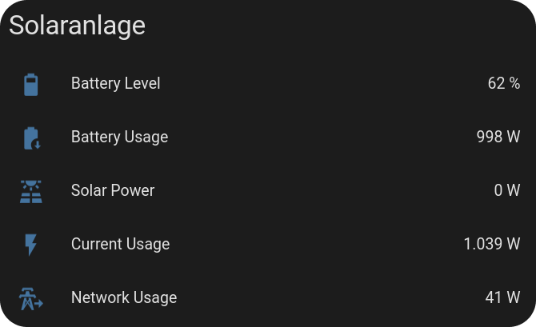

#  Home Assistant Plexlog Integration

---
This integration allows Home Assistant to interface with [Plexlogs Devices](https://plexlog.de/), enabling local network readout of Plexlogs data 🎉. 

## Installation via HACS

Or manually add the integration repository to HACS.

## Sensors Provided
- **Battery Level** 🔋
- **Battery Usage** 📉
- **Current Power Usage** ⚡
- **Current Solar Power Register One** 🌞
- **Current Solar Power Register Two** 🌞
- **Network Usage** 🌐
  

## Features
- **UI Configuration**: Easily configure the integration through the Home Assistant UI.
- **Changing Icons**: Depending on the state of the sensor, the icon will change accordingly.

## Technical Details

### Modbus
The integration uses the Modbus protocol to communicate with the Plexlogs devices. It is using the following Modbus registers:

**Salve ID: 1**
**TCP Port: 503 (Can be changed)**

- **Current Solar Power Register One**: 0x0 Signed Integer 32
- **Current Solar Power Register Two**: 0x1 Signed Integer 32
- **Current Power Usage**: 0x2 Signed Integer 32
- **Current Power Usage**: 0x3 Signed Integer 32
- **Battery Level**: 0x36 Unsigned Integer 16
- **Battery Usage**: 0x37 Signed Integer 32
- **Battery Usage**: 0x38 Signed Integer 32

#### Finding the IP Address of the Plexlogs Device
You can also find the IP address of the Plexlogs device by our router, otherwise, for Linux users, you can use the following command:

`nmap -p 503 X.X.X.0/24 | grep "open" -C 10` 

This scan your network for devices with port 503 open.

## Note:
 This integration is in no way or form affiliated with Plexlogs. This is a third-party integration that uses the Modbus protocol to communicate with the Plexlogs devices. Therefore, there is no guarantee that this integration will work with all Plexlogs devices. If you encounter any issues, please open an issue on the GitHub repository. You also take full responsibility for any issues that may arise from using this integration.

